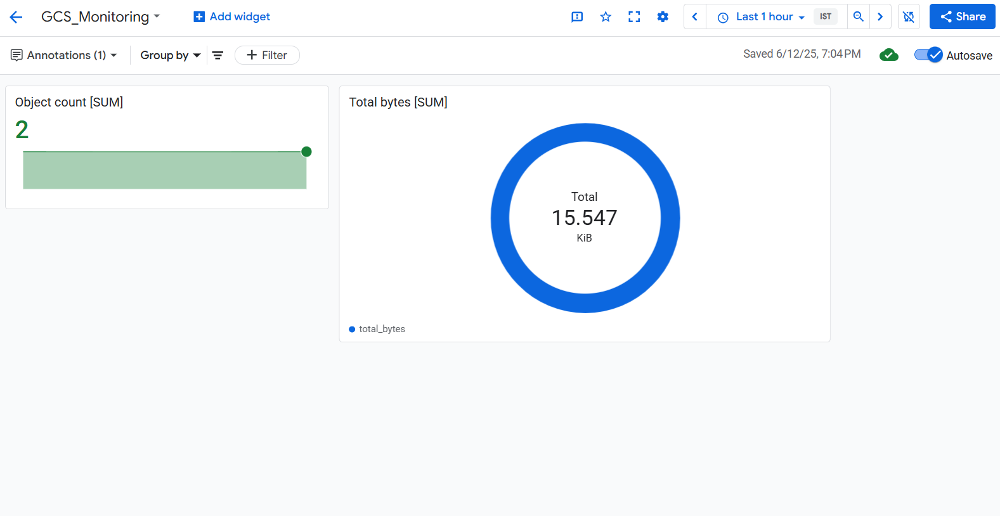
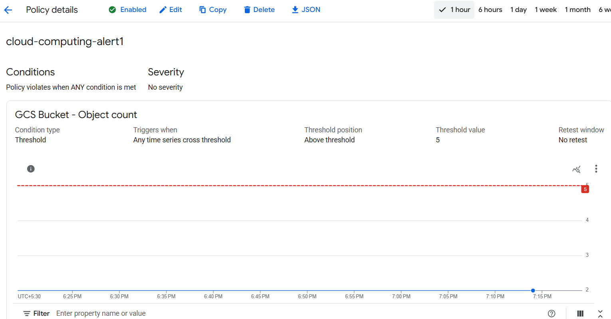

# Internship Task 2 – Cloud Monitoring and Alerts

## ✅ Objective
To set up a custom cloud monitoring dashboard and an alert policy for a Google Cloud Storage (GCS) bucket using **Google Cloud Monitoring (formerly Stackdriver)**.

---

## 🛠️ Tools Used
- **Platform**: Google Cloud Platform (GCP)
- **Monitoring Tool**: Google Cloud Monitoring
- **Resource Monitored**: Google Cloud Storage (GCS) bucket

---

## 📊 Custom Dashboard Details

A custom dashboard was created to monitor:
- **Number of objects in the GCS bucket**
- **Total storage used (in bytes)**

### 🔧 Widgets Added
1. **Scorecard**
   - **Metric**: `storage/object_count`
   - **Description**: Displays current number of files in the monitored GCS bucket.
   
2. **Pie Chart**
   - **Metric**: `storage/total_bytes`
   - **Description**: Shows how storage usage changes over time.
---

## 🚨 Alert Policy

An alert policy was configured to monitor GCS activity:

- **Metric**: `storage/object_count`
- **Condition**: Trigger alert if number of objects > 1
- **Notification Channel**: None

This ensures immediate alerts are received when file count crosses a defined threshold.

---

## 📸 Screenshots

### 1. Alert Policy

### 2. Custom Dashboard

---

---

## 📝 Notes
- Metrics may take a few minutes to appear after bucket usage (upload/download).
- Ensure that your GCS bucket has at least 1 object for metrics to populate.
